<div align="center">
  <br />
  <p>
    <a href="https://github.com/cimengabu/webPjbl"></a>
    <a href="https://github.com/cimengabu/webPjbl"></a>
    <a href="https://github.com/cimengabu/webPjbl"></a>
  </p>
  
  # 🌿 EcoTrack Indonesia

  **Platform Manajemen Bank Sampah & Pelestarian Lingkungan Berbasis Web**
</div>

---

## 📖 Deskripsi Proyek
**EcoTrack** adalah aplikasi inovatif yang dirancang untuk mendorong masyarakat agar lebih peduli terhadap lingkungan melalui sistem manajemen bank sampah yang terintegrasi. Platform ini memberikan apresiasi (berupa *Eco-Points*) kepada pengguna setiap kali mereka melakukan aksi pelestarian, seperti mendepositkan sampah daur ulang atau melaporkan masalah lingkungan. Poin yang terkumpul dapat ditukarkan (*withdraw*) menjadi saldo *e-wallet*.

Proyek ini dibangun menggunakan **Laravel 11** dan **Tailwind CSS**, dengan antarmuka (*UI*) yang dirancang sangat modern, interaktif, dan premium.

## ✨ Fitur Utama

### 👤 Fitur Pengguna (Masyarakat)
- **Dashboard Personal:** Melacak aktivitas pelestarian, total poin (PTS), dan *streak* lingkungan secara *real-time*.
- **Setor Sampah (Deposit):** Menyetor sampah ke bank sampah terdekat untuk mendapatkan poin.
- **Peta Lokasi Bank Sampah:** Menemukan lokasi bank sampah terdekat menggunakan peta interaktif (*Leaflet.js*).
- **Request Penjemputan (Pickup):** Meminta agen menjemput sampah langsung dari rumah.
- **Tarik Poin (Withdraw):** Menukarkan *Eco-Points* dengan saldo GoPay, OVO, atau DANA.
- **Laporan Lingkungan:** Melaporkan kerusakan fasilitas, tumpukan sampah liar, atau polusi di sekitar untuk mendapatkan poin tambahan.
- **Artikel Edukasi:** Membaca artikel terkait pelestarian lingkungan untuk menambah wawasan.

### 🛡️ Fitur & Hak Akses Administrator
Admin menggunakan gerbang _login_ dan tampilan *Dashboard* yang sama dengan pengguna publik (menyatu dengan mulus), namun sistem secara otomatis memberikan hak akses penuh:
- **Visibilitas Data Global:** Melihat dan mengelola seluruh riwayat *deposit*, *request* penjemputan, dan laporan dari semua pengguna di *Dashboard*.
- **Verifikasi Transaksi:** Menyetujui atau menolak *request* Penjemputan, Tarik Poin, dan Laporan.
- **Manajemen Pengguna (CRUD):** Mengelola data seluruh pengguna terdaftar dan mengawasi aktivitas mereka.
- **Manajemen Artikel (CRUD):** Mempublikasikan, mengedit, atau menghapus konten edukasi di *frontend*.
- **Manajemen Bank Sampah (CRUD):** Menambah, mengubah, atau menghapus titik koordinat bank sampah dari sistem peta.

---

## 🔄 Alur Kerja Aplikasi (Flowchart)

### 1. Alur Navigasi Utama

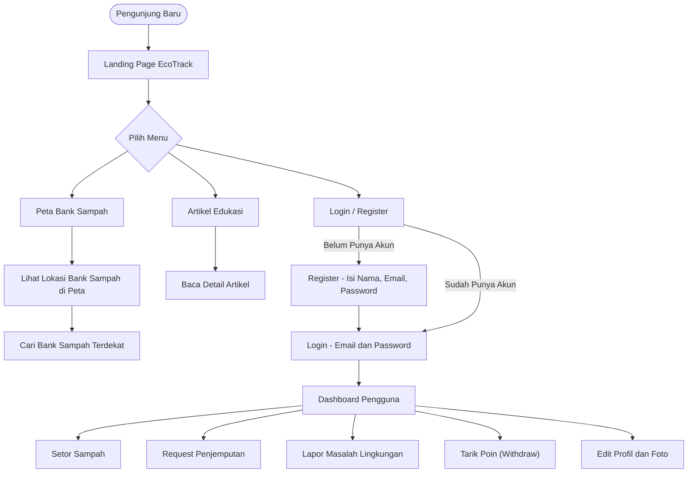

### 2. Alur Detail Setiap Fitur

```mermaid
flowchart TD
    subgraph DEPOSIT [Setor Sampah]
        A1[Buka Form Deposit] --> A2[Pilih Jenis Sampah]
        A2 --> A3[Masukkan QR Code dan Berat]
        A3 --> A4[Sistem Hitung Poin Otomatis]
        A4 --> A5[Data Tersimpan]
        A5 --> A6[Poin Masuk ke Akun]
    end

    subgraph PICKUP [Request Penjemputan]
        B1[Buka Form Penjemputan] --> B2[Isi Tanggal Penjemputan]
        B2 --> B3[Isi Estimasi Berat dan Alamat]
        B3 --> B4[Kirim Request]
        B4 --> B5[Status: Pending]
        B5 --> B6[Menunggu Konfirmasi]
    end

    subgraph REPORT [Lapor Masalah Lingkungan]
        C1[Buka Form Laporan] --> C2[Tulis Deskripsi Masalah]
        C2 --> C3[Isi Lokasi Kejadian]
        C3 --> C4[Upload Foto Bukti]
        C4 --> C5[Kirim Laporan]
        C5 --> C6[Status: Pending]
    end

    subgraph WITHDRAW [Tarik Poin]
        D1[Buka Form Withdraw] --> D2{Poin Mencukupi?}
        D2 -->|Tidak| D3[Penarikan Gagal]
        D2 -->|Ya| D4[Pilih Metode: GoPay / OVO / DANA]
        D4 --> D5[Isi Nominal dan No. Rekening]
        D5 --> D6[Poin Dipotong dari Akun]
        D6 --> D7[Dana Terkirim ke e-Wallet]
    end
```

## 🛠️ Teknologi yang Digunakan

* **Backend:** Laravel 11.x (PHP)
* **Frontend:** Blade Templating, Tailwind CSS (Vanilla + PostCSS)
* **Database:** MySQL / SQLite

**Database Schema**

| Table | Columns |
|-------|---------|
| `users` | `id` (bigIncrements), `name` (string), `email` (string, unique), `email_verified_at` (timestamp, nullable), `password` (string), `remember_token` (string, nullable), `is_admin` (boolean, default false), `profile_photo_path` (string, nullable), `total_points` (integer, default 0), `created_at`, `updated_at` |
| `password_reset_tokens` | `email` (string, primary), `token` (string), `created_at` (timestamp, nullable) |
| `sessions` | `id` (string, primary), `user_id` (foreignId, nullable), `ip_address` (string, 45, nullable), `user_agent` (text, nullable), `payload` (longText), `last_activity` (integer) |
| `recycling_centers` | `id` (bigIncrements), `name` (string), `address` (string), `latitude` (decimal), `longitude` (decimal), `accepted_materials` (json, nullable), `maps_url` (string, nullable), `created_at`, `updated_at` |
| `reports` | `id` (bigIncrements), `user_name` (string), `photo` (string), `description` (text), `location` (string), `status` (enum: `pending`, `process`, `resolved`, default `pending`), `created_at`, `updated_at` |
| `eco_activities` | `id` (bigIncrements), `user_id` (foreignId), `type` (enum: `deposit`, `pickup`, `withdraw`, `report`), `points` (integer), `description` (text, nullable), `created_at`, `updated_at` |
| `eco_tracks` | `id` (bigIncrements), `user_id` (foreignId), `activity_id` (foreignId), `points` (integer), `created_at`, `updated_at` |
| `withdraws` | `id` (bigIncrements), `user_id` (foreignId), `amount` (decimal), `status` (enum: `pending`, `approved`, `rejected`, default `pending`), `created_at`, `updated_at` |
| `pickups` | `id` (bigIncrements), `user_id` (foreignId), `center_id` (foreignId), `schedule_at` (datetime), `status` (enum: `requested`, `scheduled`, `completed`, `cancelled`, default `requested`), `created_at`, `updated_at` |
| `articles` | `id` (bigIncrements), `title` (string), `content` (longText), `image_path` (string, nullable), `author_id` (foreignId), `created_at`, `updated_at` |
| `updates` | `id` (bigIncrements), `title` (string), `content` (text), `image_path` (string, nullable), `created_at`, `updated_at` |

The `maps_url` column stores the Google Maps link for each recycling center, enabling direct navigation from the platform.

* **Map Engine:** Leaflet.js & OpenStreetMap
* **Ikon:** Heroicons

---

## ⚙️ Persyaratan Sistem (*Prerequisites*)

Pastikan Anda telah menginstal *software* berikut di perangkat Anda:
- **PHP** >= 8.2
- **Composer** (untuk dependensi backend)
- **Node.js** & **NPM** (untuk *build* frontend)
- **MySQL / MariaDB** (atau SQLite)
- **Git**

---

## 🚀 Panduan Instalasi

Ikuti langkah-langkah di bawah ini untuk menjalankan EcoTrack di lokal Anda:

1. **Clone repositori ini**
   ```bash
   git clone https://github.com/cimengabu/webPjbl.git
   cd webPjbl
   ```

2. **Instal dependensi PHP & Node.js**
   ```bash
   composer install
   npm install
   ```

3. **Salin file environment & konfigurasi Database**
   ```bash
   cp .env.example .env
   ```
   > **Note:** Buka file `.env` yang baru dibuat dan sesuaikan konfigurasi database Anda (misal `DB_DATABASE=ecotrack`, username, password).

4. **Generate Application Key**
   ```bash
   php artisan key:generate
   ```

5. **Migrasi Database**
   ```bash
   php artisan migrate
   ```

6. **Buat Symlink untuk Storage (Wajib untuk gambar artikel/profil)**
   ```bash
   php artisan storage:link
   ```

7. **Compile aset Frontend (Tailwind CSS)**
   ```bash
   npm run build
   # atau gunakan 'npm run dev' untuk mode development
   ```

8. **Jalankan Server Lokal Laravel**
   ```bash
   php artisan serve
   ```
   Aplikasi sekarang dapat diakses melalui `http://localhost:8000`.

---

## 📸 Tangkapan Layar (Screenshots)

### 🔐 Halaman Autentikasi
<div align="center">
  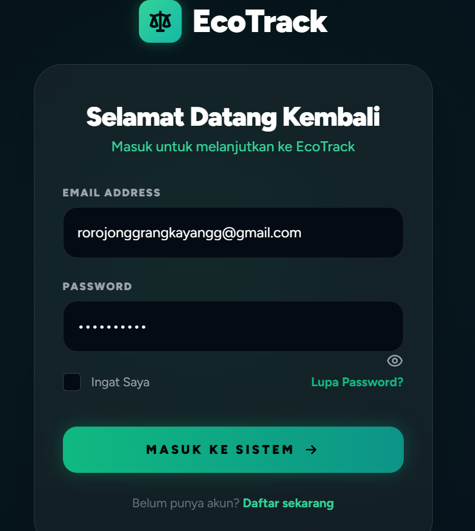
  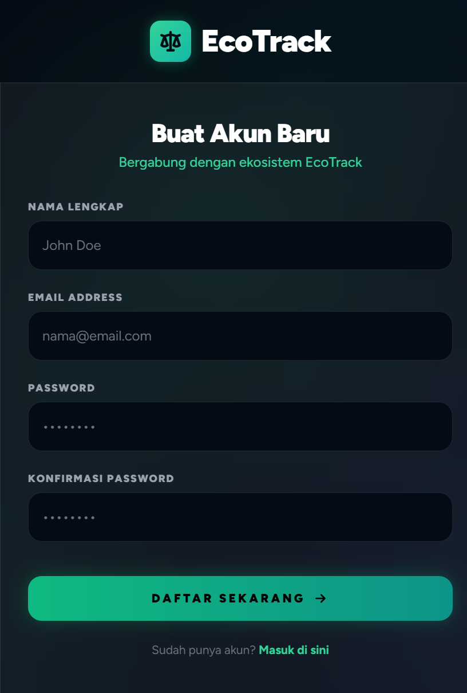
</div>

### 🏠 Beranda (Landing Page)
<div align="center">
  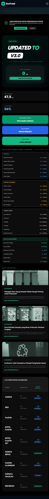
  <br><br>
  
  
</div>

### 📊 Dashboard Pengguna
<div align="center">
  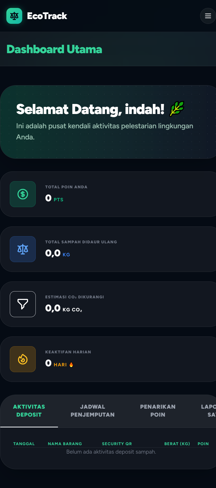
  <br><br>
  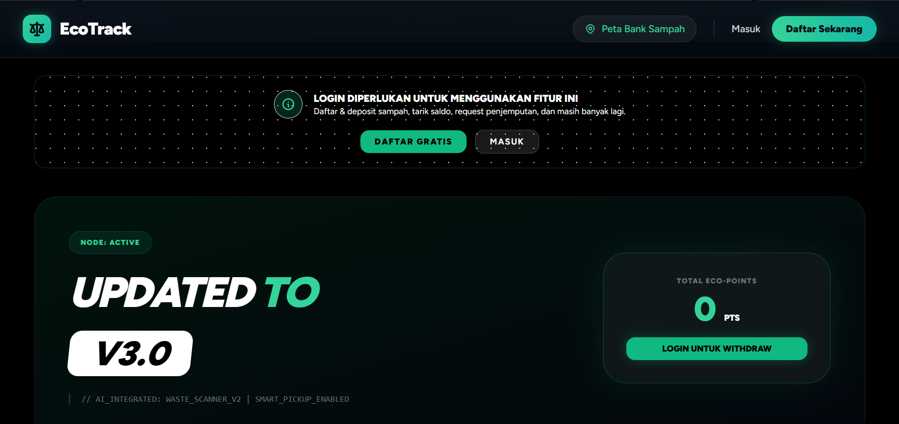
  
  <br><br>
  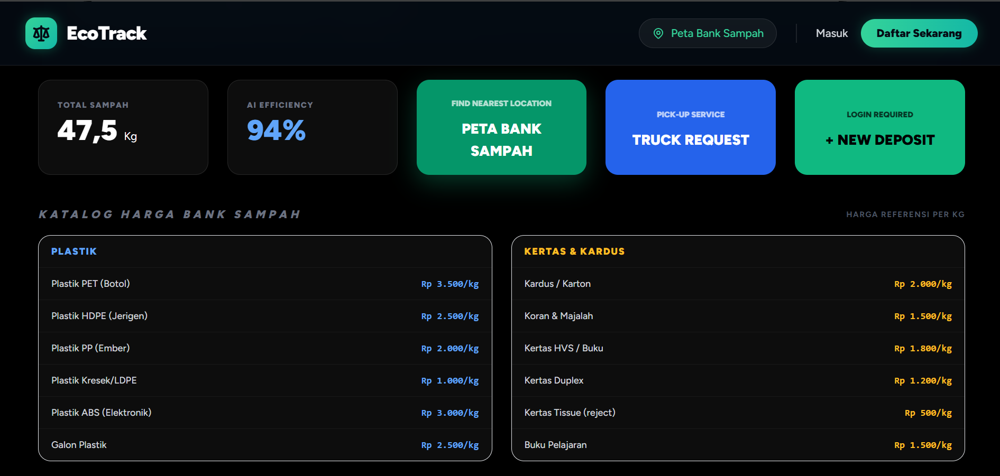
  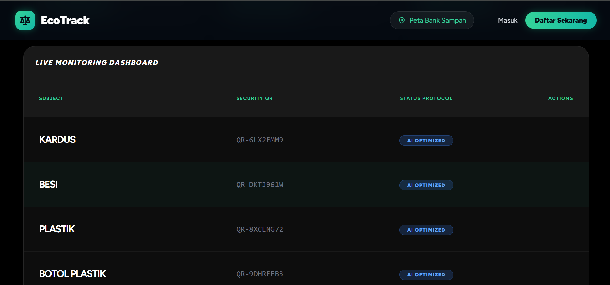
</div>

### 🌍 Fitur Utama & Profil
<div align="center">
  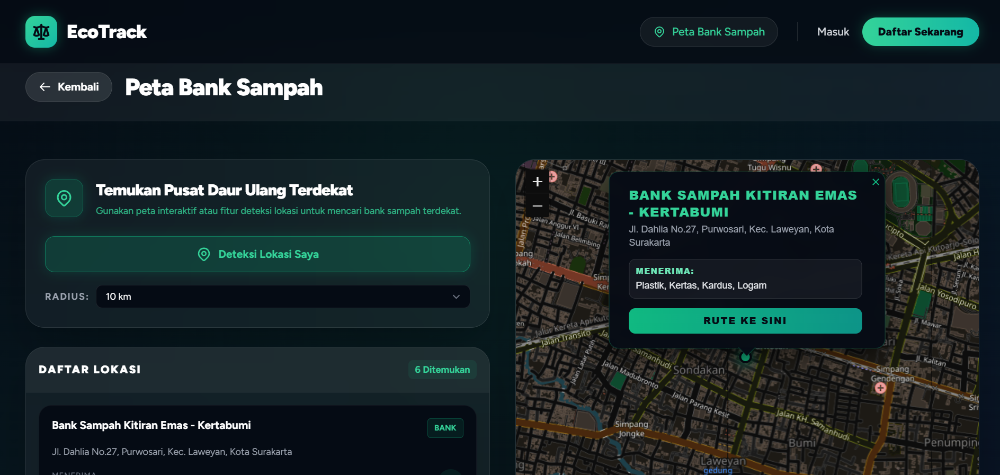
  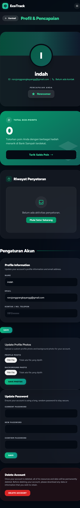
  <br><br>
  
  
</div>

<br>

---
<div align="center">
  <p>Dibuat dengan ❤️ untuk pelestarian lingkungan.</p>
</div>

